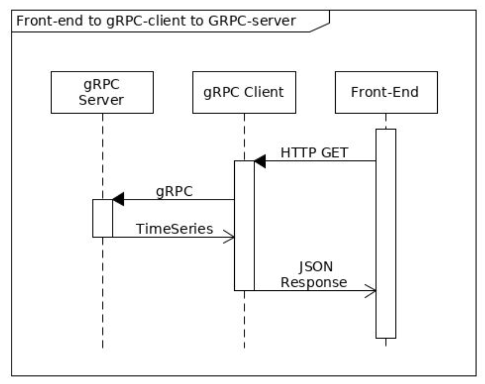

# Spectral Tech Assignment

## Overview

An application for monitoring electricity usage.

## How to run the project

- Run the gRPC server

  ```bash
  make run-server
  ```

- Run the web application

  ```bash
  make run-client
  ```

Open http://localhost:8080 in your browser.

## Requirements

- Create a gRPC server that serves the time based electricity consumption data found in meterusage.csv.
- HTTP server that serves the data in JSON format.
- A single page html application that displays the data.

## Architecture



## API

### GetUsages

GetUsages returns the usages of electricity in the given time range.

#### Request

| Field      | Type   | Format  | Description                  |
| ---------- | ------ | ------- | ---------------------------- |
| start_time | string | RFC3339 | Start time of the time range |
| end_time   | string | RFC3339 | End time of the time range   |

```json
# Example
{
  "start_time": "2022-01-01T00:00:00Z",
  "end_time": "2022-01-01T01:00:00Z"
}
```

#### Response

| Field       | Type    | Description                    |
| ----------- | ------- | ------------------------------ |
| data        | Data    | The usages of electricity      |
| data.total  | float64 | The total usage of electricity |
| data.usages | []Usage | The usages of electricity      |

```json
# Example
{
    "data": {
        "total": float64,
        "usages": [
            {
                "time": "2006-01-02T15:04:05Z",
                "usage": float32
            }
        ]
    }
}

```

### Response

Data contains the usages of electricity.

| Field  | Type    | Description                    |
| ------ | ------- | ------------------------------ |
| total  | float64 | The total usage of electricity |
| usages | []Usage | The usages of electricity      |

#### Usage

| Field | Type    | Description              |
| ----- | ------- | ------------------------ |
| time  | string  | The time of the usage    |
| usage | float64 | The usage of electricity |

## Database

- The data was given in the form of a CSV file.
- However, the data will be sanitized and stored in a SQLite database to make it easier to query

Table name: `meter_usages`
| Field | Type | Description |
| ----- | ------- | ------------------------ |
| time | string | The time of the usage |
| usage | float64 | The usage of electricity |

## Web application

Simple web application that allows the user to submit start time and end time range.

## Client

Client interface to allow the web application to communicate with the gRPC server.

## gRPC Server

The gRPC server is a gRPC server that serves the time based electricity consumption data found in meterusage.csv.
